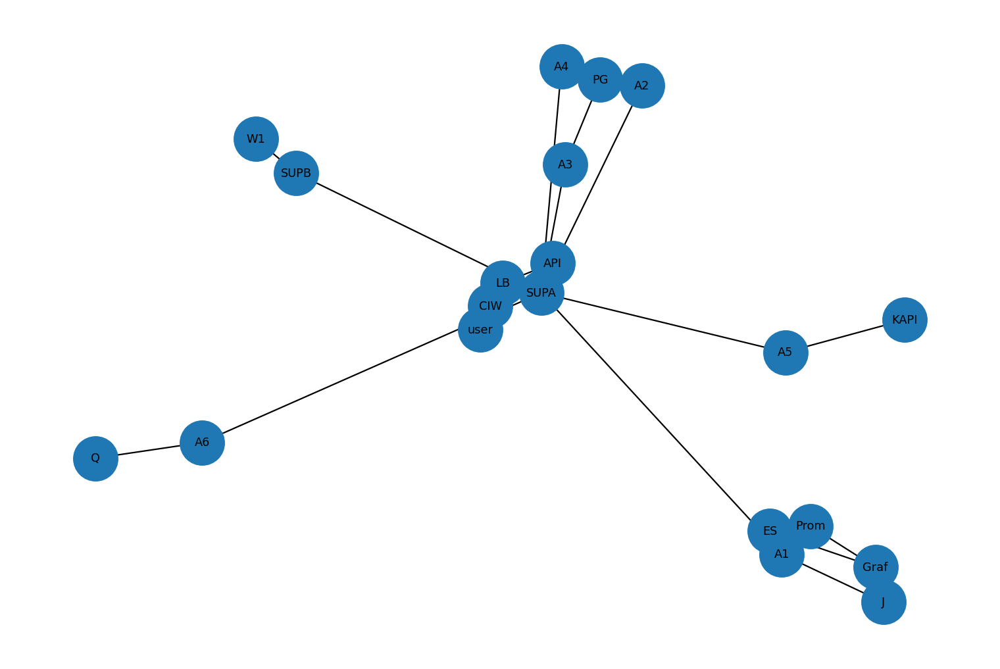

# AURORA Deployment Diagram (Hybrid)

The deployment shows a hybrid setup across on‑prem and cloud Kubernetes clusters, CI/CD, and autoscaling (HPA/VPA), consistent with the paper's production case‑study.

```mermaid
%% AURORA Deployment (Hybrid: On‑Prem + Cloud) from AgenticRCA paper
flowchart TB
  user[End Users / Clients] --> LB[API Gateway / Ingress]
  LB --> API[FastAPI Service]
  subgraph ClusterA["On‑Prem Kubernetes"]
    API
    SUPA[Supervisor]
    A1[Telemetry Agent]
    A2[Anomaly Agent]
    A3[Causal Agent]
    A4[Localization Agent]
    A5[Remediation Agent]
    A6[Learning Agent]
    PG[(PostgreSQL)]
    R[(Redis)]
    Q[(Qdrant / Vector DB)]
    Prom[Prometheus]
    ES[Elasticsearch]
    J[Jaeger]
  end

  subgraph ClusterB["Cloud Kubernetes (AWS EKS / GKE / AKS)"]
    SUPB[Supervisor (autoscaled)]
    W1[Workers / Tool Runners]
  end

  subgraph CI["CI/CD & Observability"]
    CIW[CI/CD (GitHub Actions)]
    HPA[HPA]
    VPA[VPA]
    Graf[Grafana]
  end

  API --> SUPA
  SUPA --> A1 & A2 & A3 & A4 & A5 & A6
  A1 --> Prom & ES & J
  A2 --> PG
  A3 --> PG
  A4 --> PG
  A5 --> KAPI[Kubernetes API]
  A6 --> Q

  SUPA <--> SUPB
  SUPB --> W1

  Prom --> Graf
  ES --> Graf
  J --> Graf

  CIW --> ClusterA
  CIW --> ClusterB
  HPA --- ClusterA
  VPA --- ClusterA

  classDef infra fill:#f8fafc,stroke:#94a3b8,stroke-width:1px;
  class ClusterA,ClusterB,CI infra;
```

> Source: Derived from the attached AURORA/AgenticRCA research paper (see repository root for citation).


---

**Image export:**


